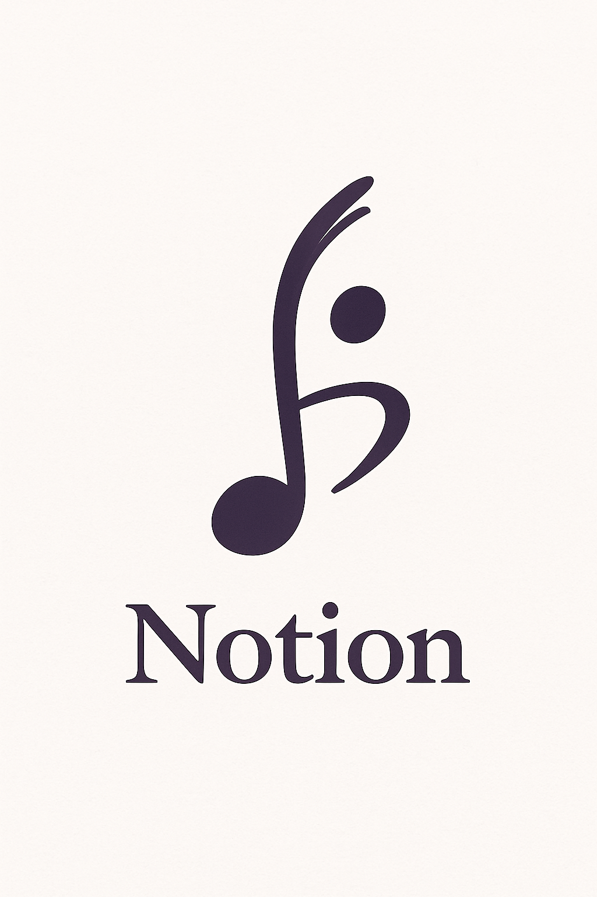

<p align="center" style="border: 1px solid transparent; border-radius: 5px;">
  
</p>

<h1 align="center">Notion AR Demo</h1>

<p align="center">
  A mobile-optimized Angular 17+ prototype demonstrating transparent AR overlays
  on real sheet music using the device camera — a foundation for the full
  Notion AR experience.
</p>

---

## 📌 Overview

This is a **frontend-only Angular application** (no backend, no database) that simulates:

- Live **camera preview** through the phone  
- **Transparent, perfectly aligned AR overlays** on sheet music  
- Dynamic **note label highlighting** to simulate playback  
- A minimal, clean control bar for **tempo** and **play/pause**  
- A structure ready to evolve into **WebXR**, **machine vision**, or **glasses-based AR**

The goal is to prototype the UX of the future **Notion AR** app — where a user points their phone or AR glasses at sheet music and receives real-time overlays, guided notation, and audio playback.

---

## 🎥 Demo Features

### ✔ Camera Layer  
Uses `navigator.mediaDevices.getUserMedia()` to display the rear camera feed.

### ✔ Overlay Layer  
Transparent labels positioned relative to the staff:

- Note names above real notes  
- Highlight animation moving through notes  
- Subtle staff guides (for demo purposes)

### ✔ Playback Simulation  
A lightweight timing loop that cycles through demo notes at the selected tempo.

### ✔ Standalone Angular Architecture  
Built using Angular 17+ standalone components — no `NgModule` required.

---

## 🚀 Getting Started

Make sure you have:

- Node.js 18+  
- Angular CLI 17+  

### Clone the repository

```bash
git clone <your-repo-url>
cd notion-ar-demo
